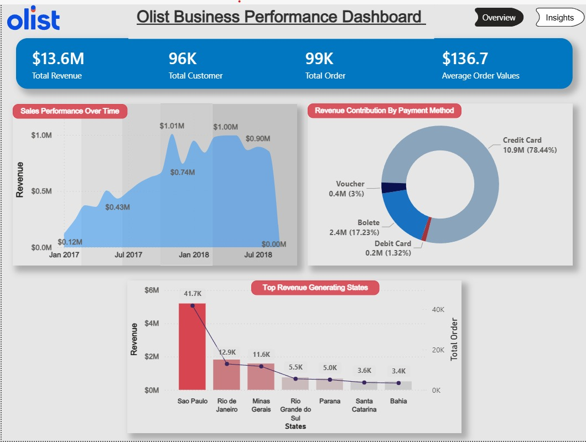
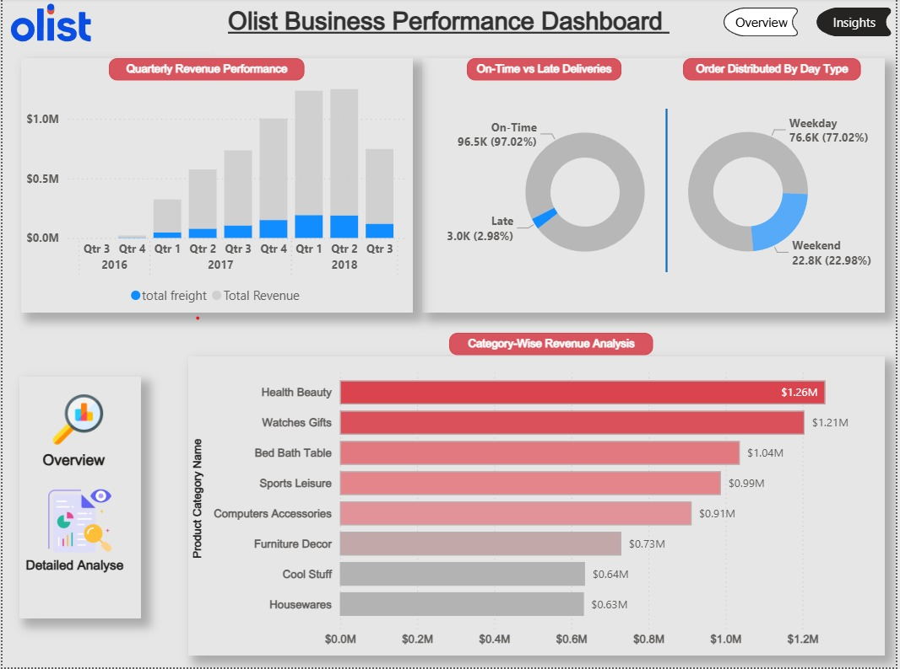
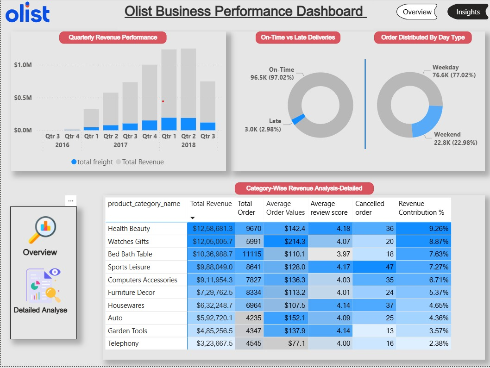

# 🛒 Olist Brazilian E-Commerce Business Performance Analysis

## 📌 Project Overview
An end-to-end data analysis project exploring the **Olist Brazilian E-commerce dataset**, encompassing over **100,000 orders from 2016 to 2018**. This project involves comprehensive data cleaning, exploratory data analysis via SQL, and the creation of an interactive business performance dashboard in Power BI. 
Transforming raw, uncleaned e-commerce data into actionable business intelligence using Excel, PostgreSQL, and Power BI to uncover insights regarding revenue trends, customer segmentation (RFM), delivery efficiency, and product performance.

## 🎯 Purpose & Business Problem
Olist connects small businesses from all over Brazil to a single, seamless e-commerce platform. The objective of this project is to analyze Olist's historical sales data to:
* Evaluate overall financial performance and revenue growth.
* Understand customer purchasing behaviors and payment preferences.
* Identify top-performing product categories and high-value sellers.
* Assess logistical efficiency (freight costs, delivery times) and its impact on customer satisfaction.

## 🛠️ Tech Stack
* **Excel:** Initial data exploration, basic formatting, and preliminary cleaning.
* **PostgreSQL:** Advanced data cleaning, anomaly detection, table joins, and complex SQL querying (Window Functions, CTEs).
* **Power BI:** Intermediate DAX, data modeling, and interactive dashboard development.

## 📂 Dataset Information
* **Source:** Kaggle (Brazilian E-Commerce Public Dataset by Olist)
* **Link:** [Olist E-Commerce Dataset](https://www.kaggle.com/datasets/olistbr/brazilian-ecommerce)
* **Description:** Real commercial data containing multiple relational tables including Customers, Orders, Order Items, Products, Payments, Reviews, and Sellers.

---

## 🔄 Project Workflow

### 1. Data Import & Initial Formatting (Excel)
* Conducted initial data profiling to understand table structures.
* Performed basic formatting before loading the raw CSV files into the database.

### 2. Data Cleaning & Transformation (PostgreSQL)
Cleaned the imported data directly within the SQL database to ensure data integrity before analysis:
* **Standardization:** Converted short-form state codes to full names (e.g., 'SP' to 'Sao Paulo'). Cleaned seller city strings by splitting inconsistent delimiters (`-` and `,`). 
* **Translation:** Joined the product table with the translation table to convert Portuguese product categories to English, replacing underscores with spaces and capitalizing names.
* **Null Handling:** Identified and handled NULL values across critical delivery and order timestamps.
* **Anomaly Detection:** Found **161 orders** where the `order_purchase_timestamp` logically occurred *after* the `order_delivered_carrier_date`.
* **Data Mapping:** Grouped raw `order_status` values into cleaner categories (`Cancelled`, `Active`, `Delivered`). Cleaned `payment_type` by replacing underscores.

### 3. SQL Business Analysis
Performed Advanced analysis to find  insights such as:
* Revenue Performance
* Monthly Revenue Trends
* Seller Contribution Analysis
* Product Category Performance
* Delivery Performance
* Customer Segmentation

### 4. Dashboard Development (Power BI)
* Exported the cleaned tables as CSVs from PostgreSQL.
* Imported the cleaned dataset into Power BI, establishing a star-schema data model.
* Utilized intermediate DAX measures for calculating KPIs (Total Revenue, AOV, % Contributions).
* Designed a two-page interactive dashboard (Overview & Detailed Analysis).

---

## 📊 Business Questions & SQL Analysis

Here are the core business questions answered using SQL:

1.  What is the total revenue generated, and what is the Average Order Value (AOV) broken down by customer state?
   
<details>
<summary><b> Query and Result</b></summary>

<br>

## 📝 SQL Code

```sql
--Total Revenue
SELECT ROUND(SUM(p.payment_value), 2) AS Total_Revenue
FROM olist_order_payments_dataset AS p
JOIN olist_orders_dataset AS o
    ON p.order_id = o.order_id
WHERE order_status_updated != 'Cancelled';


-- Average Order Value (AOV) for each customer state
SELECT c.customer_state, 
	ROUND(SUM(oi.price)/COUNT(DISTINCT oi.order_id),2) AS avg_order_value,
	COUNT(DISTINCT oi.order_id) as Total_order, 
	SUM(oi.price) as total_rev
FROM olist_customers_dataset AS c
JOIN olist_orders_dataset o ON c.customer_id=o.customer_id
JOIN olist_order_items_dataset oi ON o.order_id=oi.order_id
	WHERE O.order_status_updated !='Cancelled'
	GROUP BY c.customer_state
	order by avg_order_value desc;
```

## 📈 Query Output

### Total Revenue

| Total Revenue |
|--------------:|
| 1,573,913.01 |

### Average Order Value by Customer State

| Customer State | Avg Order Value | Total Orders | Total Revenue |
|:---------------|----------------:|-------------:|--------------:|
| Paraiba | 216.34 | 531 | 114,874.10 |
| Amapa | 198.15 | 68 | 13,474.30 |
| Acre | 197.32 | 81 | 15,982.95 |
| Alagoas | 195.41 | 411 | 80,314.81 |
| Rondonia | 187.12 | 246 | 46,031.64 |
| Para | 184.54 | 969 | 178,821.12 |
| Tocantins | 177.73 | 278 | 49,407.99 |
| Piaui | 176.86 | 490 | 86,660.09 |
| Mato Grosso | 173.30 | 902 | 156,313.53 |
| Rio Grande do Norte | 172.27 | 482 | 83,034.98 |

</details>

2. What is the monthly revenue, and what is the Month-over-Month (MoM) revenue growth?
<details>
<summary><b>Query And Result</b></summary>

<br>

## 📝 SQL Code

```sql
SELECT 
    EXTRACT(MONTH FROM o.order_purchase_timestamp) AS months,
    EXTRACT(YEAR FROM o.order_purchase_timestamp) AS years,
    ROUND(SUM(oi.price), 2) AS monthly_rev
FROM olist_orders_dataset AS o
JOIN olist_order_items_dataset AS oi 
    ON o.order_id = oi.order_id
WHERE o.order_status_updated != 'Cancelled'
GROUP BY 
    EXTRACT(YEAR FROM o.order_purchase_timestamp),
    EXTRACT(MONTH FROM o.order_purchase_timestamp)
ORDER BY years, months;
```

## 📊 Query Output

| Month | Year | Monthly Revenue |
|------:|-----:|----------------:|
| 9 | 2016 | 207.86 |
| 10 | 2016 | 44,507.30 |
| 12 | 2016 | 10.90 |
| 1 | 2017 | 120,098.27 |
| 2 | 2017 | 244,959.35 |
| 3 | 2017 | 368,341.32 |
| 4 | 2017 | 353,842.98 |
| 5 | 2017 | 503,159.19 |
| 6 | 2017 | 429,916.61 |
| 7 | 2017 | 492,287.30 |
| 8 | 2017 | 568,245.79 |
| 9 | 2017 | 621,415.91 |
| 10 | 2017 | 660,179.62 |
| 11 | 2017 | 1,003,862.14 |
| 12 | 2017 | 742,183.79 |
| 1 | 2018 | 945,456.29 |
| 2 | 2018 | 837,895.43 |
| 3 | 2018 | 981,051.06 |

</details>
3. Which are the top-selling product categories, and what is their percentage contribution to overall sales?
 <details>
<summary><b>Query And Result</b></summary>

<br>

## 📝 SQL Code

```sql
SELECT 
    p.product_category_name,
    COUNT(*) AS total_sold,
    ROUND(SUM(oi.price)) AS rev,
    ROUND(100 * SUM(oi.price) / SUM(SUM(oi.price)) OVER (), 2) AS sales_rev_pct,
    ROW_NUMBER() OVER (ORDER BY SUM(oi.price) DESC) AS ranks
FROM olist_products_dataset AS p
JOIN olist_order_items_dataset AS oi 
    ON p.product_id = oi.product_id
GROUP BY p.product_category_name
ORDER BY rev DESC
LIMIT 10;
```

## 📊 Query Output

| Product Category | Total Sold | Revenue | Sales Revenue % | Rank |
|:-----------------|-----------:|--------:|----------------:|-----:|
| Health Beauty | 9,670 | 1,258,681 | 9.26% | 1 |
| Watches Gifts | 5,991 | 1,205,006 | 8.87% | 2 |
| Bed Bath Table | 11,115 | 1,036,989 | 7.63% | 3 |
| Sports Leisure | 8,641 | 988,049 | 7.27% | 4 |
| Computers Accessories | 7,827 | 911,954 | 6.71% | 5 |
| Furniture Decor | 8,334 | 729,762 | 5.37% | 6 |
| Cool Stuff | 3,796 | 635,291 | 4.67% | 7 |
| Housewares | 6,964 | 632,249 | 4.65% | 8 |
| Auto | 4,235 | 592,720 | 4.36% | 9 |
| Garden Tools | 4,347 | 485,256 | 3.57% | 10 |

</details>
4. Which specific sellers contribute to the top 80% of total gross revenue?

<details>
<summary><b>Query And Result</b></summary>

<br>

## 📝 SQL Code

```sql
SELECT *
FROM (
    SELECT 
        seller_id,
        total,
        ROUND(
            100 * SUM(total) OVER (ORDER BY total DESC)
            / SUM(total) OVER (), 2
        ) AS pct
    FROM (
        SELECT 
            seller_id,
            SUM(price) AS total
        FROM olist_order_items_dataset
        GROUP BY seller_id
    ) AS seller_sales
) AS revenue_distribution
WHERE pct <= 80
ORDER BY total DESC;
```

## 📊 Query Output (Top Sellers)

| Seller ID | Revenue | Cumulative Revenue % |
|:----------|--------:|---------------------:|
| 4869f7a5dfa277a7dca6462dcf3b52b2 | 229,472.63 | 1.69% |
| 53243585a1d6dc2643021fd1853d8905 | 222,776.05 | 3.33% |
| 4a3ca9315b744ce9f8e9374361493884 | 200,472.92 | 4.80% |
| fa1c13f2614d7b5c4749cbc52fecda94 | 194,042.03 | 6.23% |
| 7c67e1448b00f6e969d365cea6b010ab | 187,923.89 | 7.61% |
| 7e93a43ef30c4f03f38b393420bc753a | 176,431.87 | 8.91% |
| da8622b14eb17ae2831f4ac5b9dab84a | 160,236.57 | 10.09% |
| 7a67c85e85bb2ce8582c35f2203ad736 | 141,745.53 | 11.13% |
| 1025f0e2d44d7041d6cf58b6550e0bfa | 138,968.55 | 12.16% |
| 955fee9216a65b617aa5c0531780ce60 | 135,171.70 | 13.15% |

</details>

5. Which two distinct product categories are most frequently purchased together in the exact same order?
<details>
<summary><b>Query And Result</b></summary>

<br>

## 📝 SQL Code

```sql
WITH category AS (
    SELECT DISTINCT 
        oi.order_id,
        p.product_category_name
    FROM olist_order_items_dataset AS oi
    JOIN olist_products_dataset AS p 
        ON oi.product_id = p.product_id
)

SELECT 
    a.product_category_name AS c1,
    b.product_category_name AS c2,
    COUNT(*) AS order_together
FROM category AS a
JOIN category AS b
    ON a.order_id = b.order_id
    AND a.product_category_name < b.product_category_name
GROUP BY 
    a.product_category_name,
    b.product_category_name
ORDER BY order_together DESC
LIMIT 1;
```

## 📊 Query Output

| Product Category 1 | Product Category 2 | Orders Together |
|:------------------|:------------------|----------------:|
| Bed Bath Table | Furniture Decor | 70 |

</details>

## 📈 Key Findings

* **Revenue Highlights:** The platform generated **$13.6M** in total revenue across **99K** orders, with an Average Order Value of **$136.70**. 
* **Geographical Dominance:** Sao Paulo is the undisputed market leader, generating approximately **$5M** in revenue and accounting for over **41.7K** total orders, dwarfing all other states.
* **Payment Preferences:** Credit cards absolutely dominate the platform, making up **78.44% ($10.9M)** of all transaction revenue, followed by Boleto at 17.23%.
* **Product Leaders:** Health & Beauty ($1.26M) and Watches & Gifts ($1.21M) are the top two revenue-generating categories.
* **Logistics & Satisfaction:** Olist maintains an excellent delivery standard with **97.02%** of deliveries arriving on time. SQL analysis confirms a direct correlation between early/on-time deliveries and higher customer review scores.
* **Order Timings:** The vast majority of purchasing activity (77.02%) occurs during weekdays.

## 💡 Business Impact & Insights

* **Payment Strategy Optimization:** The strong dependence on credit card transactions (78.44%) indicates a highly formalized customer base, but it also presents opportunities for payment diversification. Introducing or incentivizing alternative local payment methods could capture unserved market segments.
* **Geographical Expansion Opportunities:** Revenue and order volumes are heavily concentrated within a few key states (led by Sao Paulo). This highlights massive expansion opportunities and the potential to build targeted regional marketing campaigns in underperforming states.
* **Strategic Category Focus:** Health & Beauty and Watches & Gifts are the absolute core revenue drivers for the platform. Marketing spend, supplier acquisition efforts, and platform promotions should remain strategically focused on maintaining dominance in these categories.
* **Logistics as a Retention Driver:** The exceptionally high on-time delivery rate (97.02%) directly drives positive customer review scores. Maintaining this logistical efficiency is a critical component of Olist's brand reputation and customer retention strategy.
* **Data-Driven Marketing:** The implementation of the RFM segmentation model enables the marketing team to execute hyper-targeted retention strategies—such as re-engaging "Bronze" customers with win-back offers and VIP-treating "Platinum" customers to maximize lifetime value (LTV).

* ## Dashboard Screenshots

### Overview Dashboard



### Insights Dashboard



### Detailed-Insights Dashboard


